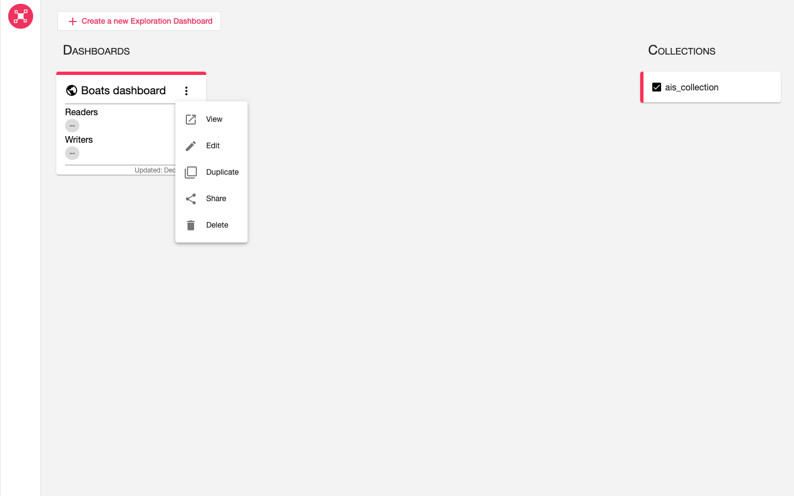
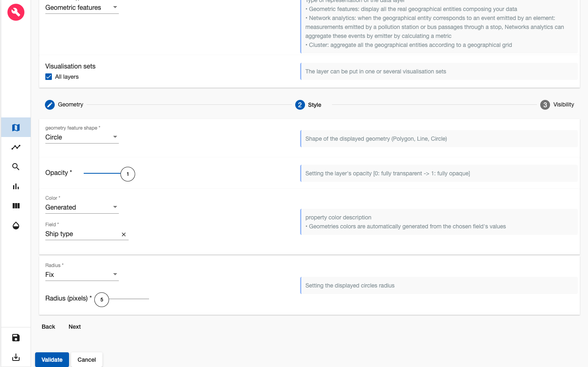
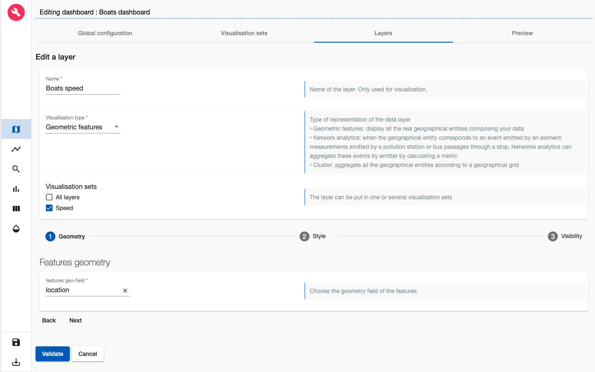
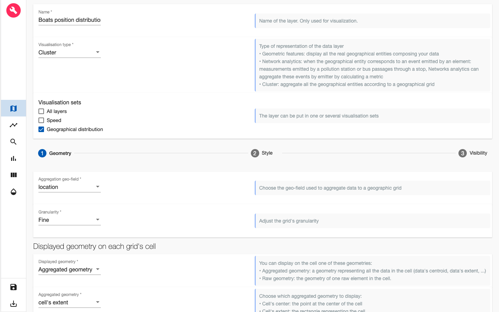

# ARLAS-stack-ais-tutorial

## About this tutorial
### What will you learn ?
With this tutorial, you'll be able to:
- start an ARLAS-Exploration stack
- Index some AIS data in Elasticsearch
- Reference the indexed AIS data in ARLAS
- Create a view of ARLAS-wui (a dashboard) to explore the AIS data using ARLAS-wui-hub and ARLAS-wui-builder

### What will you need ?

You will need :
- docker & docker-compose
- curl

<br />

### What will you get ?

<br />
<p align="center">
    
</p>
<p align="center" style="font-style: italic;" >
 Exploration app created in this tutorial
</p>

## AIS data


Let's explore some boats position data, provided by __Danish Maritime Authority__.

This tutorial is based on AIS data from 11/20/2019 to 11/27/2019 on which we have extract some boats based on following MMSI : 
 - 257653000
 - 265177000
 - 220051000
 - 240305000

First, download all the data you need on the [Danish Maritime Authority FTP](ftp://ftp.ais.dk/ais_data) :

```shell
# Example for the 11/20/2019
curl -O ftp://ftp.ais.dk/ais_data/aisdk_20191120.csv

```
And extract only desire MMSI :

```shell
cat aisdk_20191120.csv | grep -E "257653000|265177000|220051000|240305000" > ais_data.csv

```
If you don't want to create your custom extract you can use the one we provide.

We built a subset named `ais_data.csv`. It contains around 162192 boats positions described with 26 columns.

Example of some columns:
- Timestamp: Moment when the position is emitted
- MMSI: Identifier of the boats emitter
- Name: Name of the boat
- Ship type: Type of the boat

A line of the csv file looks like:

|Timestamp|Type of mobile|MMSI|Latitude|Longitude|Navigational status|ROT|SOG|COG|Heading|IMO|Callsign|Name|Ship type|Cargo type|Width|Length|Type of position fixing device|Draught|Destination|ETA|Data source type|A|B|C|D|  
|---|---|---|---|---|---|---|---|---|---|---|---|---|---|---|---|---|---|---|---|---|---|---|---|---|---|
|20/11/2019 06:45:09|Class A|240305000|55.931783|17.345067|Under way using engine|0.0|10.5|257.0|259|9288710|SYEF|DELTA CAPTAIN|Tanker|""|44|249|GPS|10.0|FOR ORDERS|22/11/2019 06:00:00|AIS|216|33|22|22|

## Exploring AIS data

We will explore this data using ARLAS.

__0. Setup__

- Create a repository dedicated to this tutorial

    ```shell
    mkdir ARLAS-stack-ais-tutorial
    cd ARLAS-stack-ais-tutorial

    ```

- Download the AIS position data

    ```shell
    curl -O -L https://github.com/gisaia/ARLAS-stack-ais-tutorial/raw/develop/data/ais_data.csv

    ```

- Check that `ais_data.csv` file is downloaded

    ```
    ls -l ais_data.csv
    ```

- Download last version of Exploration stack ans unzip it

    ```shell
    (curl -O -L https://github.com/gisaia/ARLAS-Exploration-stack/archive/develop.zip; unzip develop.zip)

    ```

- Check that the stack is downloaded

    ```
    ls -l ARLAS-Exploration-stack-develop
    ```

__1. Starting ARLAS Exploration Stack__

- Start the ARLAS stack
    ```shell
    ./ARLAS-Exploration-stack-develop/start.sh

    ```

__2. Indexing AIS data in Elasticsearch__

- Create `ais_index` index in Elasticsearch with `configs/ais.es_mapping.json` mapping file

    ```shell
    curl https://raw.githubusercontent.com/gisaia/ARLAS-stack-ais-tutorial/develop/configs/ais.es_mapping.json |
    curl -XPUT http://localhost:9200/ais_index/?pretty \
    -d @- \
    -H 'Content-Type: application/json'

    ```

    You can check that the index is successfuly created by running the following command

    ```shell
    curl -XGET http://localhost:9200/ais_index/_mapping?pretty

    ```

- Index data in `ais_data.csv` in Elasticsearch
    - We need Logstash as a data processing pipeline that ingests data in Elasticsearch. So we will download it and untar it:

        ```shell
        ( curl -O https://artifacts.elastic.co/downloads/logstash/logstash-7.4.2.tar.gz ; tar -xzf logstash-7.4.2.tar.gz )

        ```
    - Logstash needs a configuration file (`ais2es.logstash.conf`) that indicates how to transform data from the CSV file and index it in Elasticsearch.

        ```shell
        curl https://raw.githubusercontent.com/gisaia/ARLAS-stack-ais-tutorial/develop/configs/ais2es.logstash.conf -o ais2es.logstash.conf

        ```
    
    - Now we can index the data:

        ```shell
        cat ais_data.csv \
        | ./logstash-7.4.2/bin/logstash -f ais2es.logstash.conf

        ```
    - Check if __162189__ AIS positions are indexed:

        ```shell
        curl -XGET http://localhost:9200/ais_index/_count?pretty

        ```
__3. Declaring `ais_index` in ARLAS__

ARLAS-server interfaces with data indexed in Elasticsearch via a collection reference.

The collection references an identifier, a timestamp, and geographical fields which allows ARLAS-server to perform a spatial-temporal data analysis


- Create a AIS collection in ARLAS

    ```shell
        curl "https://raw.githubusercontent.com/gisaia/ARLAS-stack-ais-tutorial/develop/ais_collection.json" | curl -X PUT \
        --header 'Content-Type: application/json;charset=utf-8' \
        --header 'Accept: application/json' \
        "http://localhost:81/server/collections/ais_collection?pretty=true" \
        --data @-

    ```

- Check that the collection is created using the ARLAS-server `collections/{collection}`

    ```
    curl -X GET "http://localhost:81/server/collections/ais_collection?pretty=true"

    ```
__4. Create a dashbord to explore `AIS data` with ARLAS__

ARLAS stack is up and running and we have ais position data available for exploration. We can now create our first dashboard composed of
- a map to observe the boats positions' geographical distribution
- a timeline presenting the number of boats positions over time
- a search bar to look for boats by their names for instance
- some widgets to analyse the data from another axis such as the speed distribution.

To do so, let's go to [ARLAS-wui-hub](http://localhost:81/hub) and create a new dashboard named `Boats dashboard`

<p align="center">
    
</p>
<p align="center" style="font-style: italic;" >
figure 0: Creation of a dashboard in ARLAS-wui-hub
</p>
<br />

After clicking on __Create__, you are automatically redirected to ARLAS-wui-builder to start configuring your dashboard.

### Choosing the collection

The first thing we need to do is to tell ARLAS which collection of data we want to use to create our dashboard

<p align="center">
    
</p>
<p align="center" style="font-style: italic;" >
figure 1: Choose collection
</p>
<br />

in our case we choose the `ais_collection`

### Map configuration

As a first step, I'll set the map at zoom level 13 and the map's center coordinates at Latitude=57,451545 and Longitude=10,787131. This way, when loading my dashboard in ARLAS-wui, the map will be positionned over Danmark.

<p align="center">
    
</p>
<p align="center" style="font-style: italic;" >
figure 2: Map initialisation
</p>
<br />

For now, the map is empty. The first thing we want to find out is where the boats are ?

<p align="center">
    
</p>
<p align="center" style="font-style: italic;" >
figure 3: Layer view
</p>
<br />

To do so, let's add a layer named `Boats` to visualise the boats positions.
In the Geometry section, choose the `location` features geo-field

<p align="center">
    
</p>
<p align="center" style="font-style: italic;" >
figure 4: Adding a Gemetric features layer named 'Boats'
</p>
<br />

Now, let's define the layer's style. As a starter, we choose the best representation of our geometries: Boats positions are points. We also choose a fixed color (green for instance) and a fixed radius of 5 pixels

<p align="center">
    
</p>
<p align="center" style="font-style: italic;" >
figure 5: Customising 'Boats' style
</p>
<br />

After clicking on Validate, our first layer is created

<p align="center">
    
</p>
<p align="center" style="font-style: italic;" >
figure 6:  New layer 'Boats' is created
</p>
<br />

We can go and preview the layer in Preview tab

<p align="center">
    
</p>
<p align="center" style="font-style: italic;" >
figure 7:  Preview of 'Boats' layer
</p>
<br />

We see now where the boats are passing by thanks to this layer
<br />
<br />

### Timeline configuration
Let's find out the time period when these positions were emitted.

For that, let's define a timeline: a histogram that will represent the number of boats positions over time.

For the x-Axis we choose the timestamp field and for the y-Axis we choose Hits count: the number of positions in each bucket. We set 50 buckets in this example

<p align="center">
    
</p>
<p align="center" style="font-style: italic;" >
figure 8:  Define timeline
</p>
<br />

In the Render tab we can set a title for the timeline, date format and the histogram type.

<p align="center">
    
</p>
<p align="center" style="font-style: italic;" >
figure 9:  Rendering of timeline
</p>
<br />
<br />

### Search Bar configuration

To define the search bar we can set :

 - the placeholder string;
 - the field used to seach keywords
 - the field used to autocomplete the searched words

<p align="center">
    
</p>
<p align="center" style="font-style: italic;" >
figure 10:  Define search bar
</p>
<br />
<br />


### Save the dashbord and start exploring in ARLAS-wui

Now we defined :

 - 'Boats' layer in the map
 - the timeline 
 - the search bar

Let's save this dashboard by clicking on the 'Disk' icon at the left-bottom of the page.

If we go back to [ARLAS-wui-hub](http://localhost:8094/), we'll find the Boats dashboard created.

<p align="center">
    
</p>
<p align="center" style="font-style: italic;" >
figure 11:  List of created dashboards
</p>
<br />

We can now __View__ it in [ARLAS-wui](http://localhost:81/wui)
<p align="center">
    
</p>
<p align="center" style="font-style: italic;" >
figure 12:  Visualize in ARLAS-wui
</p>
<br />

### Going further with the map

We now see the boats positions on the map but we can't distinguish the boats! Let's change that by setting the color from the ship type.

Let's go back to the dashboard builder and edit 'Boats' layer
<p align="center">
    
</p>
<p align="center" style="font-style: italic;" >
figure 13:  Edit a layer
</p>
<br />


In the Style section, we choose Generated colors option that will automatically generates a hex color from the chosen field values. For our case, we choose `Ship type` field
<p align="center">
    
</p>
<p align="center" style="font-style: italic;" >
figure 14:  Setting the positions colors by ship type
</p>
<br />

After saving the layer, we can preview it again and see that now we have three ship types :

 - Cargo (blue)
 - Tanker (purple)
 - Passenger (yellow)
<p align="center">
    
</p>
<p align="center" style="font-style: italic;" >
figure 15: Preview generated ship types colors
</p>
<br />

On the other hand, it could be interesting to analyse the boats speed during their trajectories.

To answer this question, let's create a dedicated layer!

Before doing that, we will first create a Visualisation set, a space where to organise layers that have to be displayed/hidden together. For instance, the 'Boats' layer is put under the 'All layers' visualisation set
<p align="center">
    
</p>
<p align="center" style="font-style: italic;" >
figure 16: List of visualisation sets
</p>
<br />

For our speed layer, let's create a new visualisation set called 'Speed'
<p align="center">
    
</p>
<p align="center" style="font-style: italic;" >
figure 17: Adding a new visualisation set
</p>
<br />

Now let's create our new layer that will allow us to analyse the boats positions speeds.
<p align="center">
    
</p>
<p align="center" style="font-style: italic;" >
figure 18: Adding a new layer for boats positions speed
</p>
<br />

In the `Style` section, we interpolate the position colors with interpolation field values. In our case we interpolate the color with the `SOG` (speed over ground) field.

We normalize the SOG values and we choose a color palette
<p align="center">
    
</p>
<p align="center" style="font-style: italic;" >
figure 19: Interpolating positions colors to positions speed
</p>
<br />

After saving this layer we can preview it in the Preview tab and start our analyse!
<p align="center">
    
</p>
<p align="center" style="font-style: italic;" >
figure 20: Preview of boats positions according to the speed
</p>
<br />

### Geo Big Data
For this tutorial, we only have ~160 000 boats positions to explore. This allowed us to display the boats positions directly on the map.

But what to do in case we had millions of positions to display ?

It would be very difficult to display them all as it would be very heavy to request all that data at once and the browser will not be able to render as many features. We will end up loosing the user experience fluidity.

Most importantly, loading millions of boats positions on the map will not be necessarily understandable: we cannot derive clear and synthesized information from it.

That's why ARLAS proposes a geo-analytic view: we can aggregate the boats positions to a geographical grid and obtain a geographical distribution !

Let's create a dedicated layer for boats positions geographical distribution.
<p align="center">
    
</p>
<p align="center" style="font-style: italic;" >
figure 21: Creating a geographical distribution layer
</p>
<br />

We choose to aggregate `location` geo-field to a geographical grid and we choose a fine granularity for this grid.

We will display on the map the grid's cells.

Let's define the style of these cells in `Style` section
<p align="center">
    
</p>
<p align="center" style="font-style: italic;" >
figure 22: Creating a geographical distribution layer
</p>
<br />

We interpolate the cells colors to the number of boats positions in each cell. That's why we choose Hits count that we normalise and choose a color palette

After saving this layer, we can again visualise it and explore where the positions are geographically
<p align="center">
    
</p>
<p align="center" style="font-style: italic;" >
figure 23: Boats positions geographical distribution
</p>
<br />

### Analytics board
We focused on the geographical and temporal analysis. We can also explore other dimensions of the data.

Let's see what does the heading distribution of these positions looks like.

To do so we need to create a histogram. ARLAS proposes to organise all the histograms and other widgets in an analytics board.

We can split the analytics board into tabs. Let's create a tab called 'Tracking' where will add our Heading distribution histogram
<p align="center">
    
</p>
<p align="center" style="font-style: italic;" >
figure 24: Creating tab in Analytics board
</p>
<br />

Once the tab is created, we can add in it a group of widgets. Let's name it 'Heading'
<p align="center">
    
</p>
<p align="center" style="font-style: italic;" >
figure 25: Creating a group in Analytics board tab
</p>
<br />

Let's now create our histogram
<p align="center">
    
</p>
<p align="center" style="font-style: italic;" >
figure 26: Choosing a histogram for heading distribution
</p>
<br />

We can give a title to the Heading distribution histogram

For the x-Axis we choose `Heading` field and for the y-Axis we choose `Hits count`: the number of positions in each bucket. 

<p align="center">
    
</p>
<p align="center" style="font-style: italic;" >
figure 27: Defining heading distribution histogram
</p>
<br />

When we save the histogram we automatically get a preview of it in the analytics board!
<p align="center">
    
</p>
<p align="center" style="font-style: italic;" >
figure 28: Preview heading distribution histogram
</p>
<br />

We can now save the dashbord again using the 'Disk' icon at the left-bottom of the page and view it ARLAS-wui
<p align="center">
    
</p>
<p align="center" style="font-style: italic;" >
figure 29: Exploring Boats dashboard in ARLAS-wui
</p>
<br />
<br />
 
As you can see we created a simple dashboard to start exploring AIS data!

Check out a more sophisticated dashboard about the AIS data [demo space](https://demo.cloud.arlas.io/arlas/wui/?config_id=Rnbr4k634bkw8RxkOCbb&extend=-0.5108640078143765,52.476089090578085,19.846802007810794,58.54532820589935)!

You can get inspired from our different [demos](https://demo.cloud.arlas.io/) to build other map layers and other widgets.
