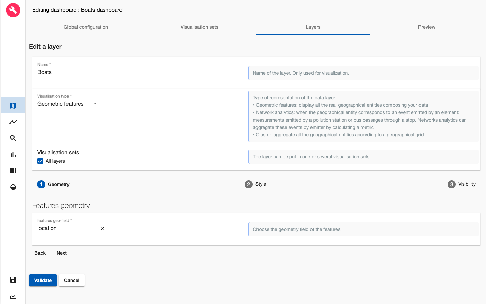

# ARLAS-stack-ais-tutorial

## About this tutorial
### What will you learn ?
With this tutorial, you'll be able to:
- start an ARLAS-Exploration stack
- Index some AIS data in Elasticsearch
- Reference the indexed AIS data in ARLAS
- Create a view of ARLAS-wui (a dashboard) to explore the AIS data using ARLAS-wui-hub and ARLAS-wui-builder

### What will you need ?

You will need :
- docker & docker-compose
- curl

### What will you get ?


## AIS data


Let's explore some boats position data, provided by __Danish Maritime Authority__.

We built a subset named `ais_data.csv`. It contains around 162192 boats positions described with 28 columns.

Example of some columns:
- Timestamp: Moment when the position is emitted
- MMSI: Identifier of the boats emitter
- Name: Name of the boat
- Ship_type: Type of the boat
- Trail_geom: Linestring between the current position of the boat and the next one
- Point_geom : Current position of the boat

A line of the csv file looks like:

|Timestamp|Type_of_mobile|MMSI|Latitude|Longitude|Navigational status|ROT|SOG|COG|Heading|IMO|Callsign|Name|Ship type|Cargo type|Width|Length|Type of position fixing device|Draught|Destination|ETA|Data source type|A|B|C|D|Trail geom|Point geom|
|---|---|---|---|---|---|---|---|---|---|---|---|---|---|---|---|---|---|---|---|---|---|---|---|---|---|---|---|
|20/11/2019 06:45:09|Class A|240305000|55.931783|17.345067|Under way using engine|0.0|10.5|257.0|259|9288710|SYEF|DELTA CAPTAIN|Tanker|""|44|249|GPS|10.0|FOR ORDERS|22/11/2019 06:00:00|AIS|216|33|22|22|"LINESTRING(17.345067 55.931783, 17.345067 55.931783)"|POINT(17.345067 55.931783)

## Exploring AIS data

We will explore this data using ARLAS.

__0. Download this tutorial__

```shell
git clone https://github.com/gisaia/ARLAS-stack-ais-tutorial.git
```

__1. Starting ARLAS Exploration Stack__

- Get the docker-compose file from [ARLAS-Exploration-stack](https://github.com/gisaia/ARLAS-Exploration-stack.git) that will allow us to start the ARLAS stack

```shell
curl -XGET \
    "https://raw.githubusercontent.com/gisaia/ARLAS-Exploration-stack/develop/docker-compose-withoutnginx.yaml" \
    -o docker-compose.yaml

```

- Start the ARLAS stack
    ```shell
    docker-compose up -d \
        arlas-wui \
        arlas-hub \
        arlas-builder \
        arlas-server \
        arlas-persistence-server \
        elasticsearch
    ```
    6 services are started:
    - ARLAS-wui at http://localhost:8096
    - ARLAS-wui-builder at http://localhost:8095
    - ARLAS-wui-hub at http://localhost:8094
    - ARLAS-server at http://localhost:19999/arlas/swagger
    - ARLAS-persistence at http://localhost:19997/arlas-persistence-server/swagger
    - Elasticsearch at http://localhost:9200

    Check that the 6 are up and running using the following command:

    ```shell
    docker ps
    ```

__2. Indexing AIS data in Elasticsearch__

- Create `ais_index` index in Elasticsearch with `configs/ais.es_mapping.json` mapping file

    ```shell
    curl -XPUT http://localhost:9200/ais_index/?pretty \
    -d @configs/ais.es_mapping.json \
    -H 'Content-Type: application/json'

    ```

    You can check that the index is successfuly created by running the following command

    ```shell
    curl -XGET http://localhost:9200/ais_index/_mapping?pretty
    ```

- Index data in `ais_data.csv` in Elasticsearch
    - We need Logstash as a data processing pipeline that ingests data in Elasticsearch. So we will download it and untar it:

        ```shell
        ( curl -O https://artifacts.elastic.co/downloads/logstash/logstash-7.4.2.tar.gz ; tar -xzf logstash-7.4.2.tar.gz )
        ```
    - Now we can index the data:

        ```shell
        cat ./data/ais_data.csv \
        | ./logstash-7.4.2/bin/logstash \
        -f configs/ais2es.logstash.conf
        ```
    - Check if __162186__ AIS positions are indexed:

        ```shell
        curl -XGET http://localhost:9200/ais_index/_count?pretty
        ```
__3. Declaring `ais_index` in ARLAS__

ARLAS-server interfaces with data indexed in Elasticsearch via a collection reference.

The collection references an identifier, a timestamp, and geographical fields which allows ARLAS-server to perform a spatial-temporal data analysis


- Create a AIS collection in ARLAS

    ```shell
    curl -X PUT \
    --header 'Content-Type: application/json;charset=utf-8' \
    --header 'Accept: application/json' \
    "http://localhost:19999/arlas/collections/ais_collection?pretty=true" \
    --data @ais_collection.json
    ```

    Check that the collection is created using the ARLAS-server `collections/{collection}`

    ```
    curl -X GET "http://localhost:19999/arlas/collections/ais_collection?pretty=true"
    ```
__4. Create a dashbord to explore `AIS data` with ARLAS__

ARLAS stack is up and running and we have ais potistion data available for exploration. We can now create our first dashboard composed of
- a map to observe the boats positions' geographical distribution
- a timeline presenting the number of boats positions over time
- a search bar to look for boats by their names for instance
- some widgets to analyse the data from another axis such as the speed distribution.

To do so, let's go to ARLAS-wui-hub at http://localhost:8094 and create a new dashboard named `Boats dashboard`

<p align="center">
    
</p>
<p align="center" style="font-style: italic;" >
figure 0: Creation of a dashboard in ARLAS-wui-hub
</p>
<br />

After clicking on __Create__, you are automatically redirected to ARLAS-wui-builder to start configuring your dashboard.

### Choosing the collection

The first thing we need to do is to tell ARLAS which collection of data we want to use to create our dashboard

<p align="center">
    
</p>
<p align="center" style="font-style: italic;" >
figure 1: Choose collection
</p>
<br />

in our case we choose the `ais_collection`

### Map configuration

As a first step, I'll set the map at zoom level 13 and the map's center coordinates at Latitude=57,451545 and Longitude=10,787131. This way, when loading my dashboard in ARLAS-wui, the map will be positionned over Danmark.

<p align="center">
    
</p>
<p align="center" style="font-style: italic;" >
figure 2: Map initialisation
</p>
<br />

For now, the map is empty. The first thing we want to find out is where the boats are ?

<p align="center">
    
</p>
<p align="center" style="font-style: italic;" >
figure 3: Layer view
</p>
<br />

To do so, let's add a layer named `Boats` to visualise the boats positions.
In the Geometry section, choose the `Point_geom` features geo-field

<p align="center">
    
</p>
<p align="center" style="font-style: italic;" >
figure 4: Adding a Gemetric features layer named 'Boats'
</p>
<br />

Now, let's define the layer's style. As a starter, we choose the best representation of our geometries: Boats positions are points. We also choose a fixed color (green for instance) and a fixed radius of 5 pixels

<p align="center">
    
</p>
<p align="center" style="font-style: italic;" >
figure 5: Customising 'Boats' style
</p>
<br />

After clicking on Validate, our first layer is created

<p align="center">
    
</p>
<p align="center" style="font-style: italic;" >
figure 6:  New layer 'Boats' is created
</p>
<br />

We can go and preview the layer in Preview tab

<p align="center">
    
</p>
<p align="center" style="font-style: italic;" >
figure 7:  Preview of 'Boats' layer
</p>
<br />

We see now where the boats are passing by thanks to this layer


...
...
...
...

As you can see we created a simple dashboard to start exploring AIS data!

Check out a more sophisticated dashboard about the AIS data [demo space](https://demo.cloud.arlas.io/arlas/wui/?config_id=Rnbr4k634bkw8RxkOCbb&extend=-0.5108640078143765,52.476089090578085,19.846802007810794,58.54532820589935)!

You can get inspired from our different [demos](https://demo.cloud.arlas.io/) to build other map layers and other widgets.
